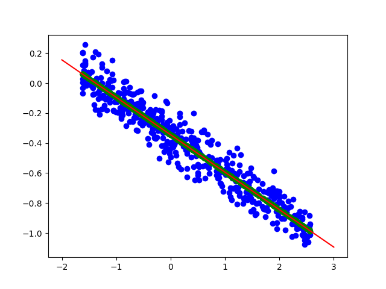

# Linear Regression Project

## Introduction

Welcome to our Linear Regression project! In this project, we explore two different methods for implementing Linear Regression: Gradient Descent and Closed-Form solution. Linear Regression is a fundamental supervised learning algorithm used for predicting continuous values based on input features.

### Objective

The main objective of this project is to compare and contrast the performance and implementation of Linear Regression using Gradient Descent and Closed-Form methods. We aim to understand the strengths and limitations of each approach and how they can be applied in real-world scenarios.

### Methods

1. **Gradient Descent Method**: We will implement the Gradient Descent algorithm to iteratively optimize the parameters of the Linear Regression model. This method involves adjusting the parameters in the direction of the gradient of the cost function to minimize the error between predicted and actual values.

2. **Closed-Form Method**: We will also explore the Closed-Form solution (ordinary least squares) for Linear Regression. This method provides an analytical solution by directly calculating the optimal parameters that minimize the cost function without the need for iterative optimization.

### Technologies Used

- Programming Language: Python
- Libraries: NumPy, pandas, matplotlib

## Linear Regression with Gradient Descent

This project implements Linear Regression using the Gradient Descent algorithm. Linear Regression is a linear model that assumes a linear relationship between the input variables (x) and the single output variable (y). It calculates y from a linear combination of the input variables.

## Project Overview

- Train the linear regression model on the given dataset and test its performance on the test data.
- Implement the linear regression model using the Closed Form solution and the Gradient Descent algorithm (batch or stochastic).
- Normalize the data to improve model performance.
- Plot the datasets and regression lines.
- Plot the cost function for enough iterations during Gradient Descent.
- Report the learned parameters (θ0, θ1, ..., θn), and the Mean Squared Error (MSE) on both the train and test data.
- Report the decision boundary in the format of "y = ax + b".

### Linear Regression with Gradient Descent

In Linear Regression, we aim to predict a continuous target variable $\( y \)$ based on one or more input features $\( x_1, x_2, ..., x_n \)$. The predicted value $\( \hat{y} \)$ is given by the equation:

$\[ \hat{y} = \theta_0 + \theta_1x_1 + \theta_2x_2 + ... + \theta_nx_n \]$

Where:
- $\( \hat{y} \)$ is the predicted target variable,
- $\( x_1, x_2, ..., x_n \)$ are the input features,
- $\( \theta_0, \theta_1, ..., \theta_n \)$ are the coefficients (parameters) to be learned.

#### Cost Function

The cost function measures the difference between the predicted values and the actual values in the training data. One commonly used cost function for Linear Regression is the Mean Squared Error (MSE), defined as:

$\[ J(\theta) = \frac{1}{2m} \sum_{i=1}^{m} (\hat{y}_i - y_i)^2 \]$

Where:
- $\( J(\theta) \)$ is the cost function,
- $\( m \)$ is the number of training examples,
- $\( \hat{y}_i \)$ is the predicted value for the $\( i^{th} \)$ example,
- $\( y_i \)$ is the actual value for the $\( i^{th} \)$ example.

#### Gradient Descent

Gradient Descent is an optimization algorithm used to minimize the cost function. The update rule for each parameter $\( \theta_j \)$ in Batch Gradient Descent is given by:

$\[ \theta_j = \theta_j - \alpha \frac{\partial}{\partial \theta_j} J(\theta) \]$

Where:
- $\( \alpha \)$ is the learning rate.

The partial derivative $\( \frac{\partial}{\partial \theta_j} J(\theta) \)$ represents the gradient of the cost function with respect to $\( \theta_j \)$.

#### Gradient Calculation

To compute the gradient of the cost function, we calculate the derivative of $\( J(\theta) \)$ with respect to each parameter $\( \theta_j \)$. For the MSE cost function, the gradient for $\( \theta_j \)$ is given by:

$\ \frac{\partial}{\partial \theta_j} J(\theta) \ = \ \frac{1}{m} \sum_{i=1}^{m} (\hat{y}_i - y_i) \cdot x_ij \$

$\( x_{ij} \)$
Where:
- $\( x_{ij} \)$ is the $\( j^{th} \)$ feature of the $\( i^{th} \)$ example.

#### Update Rule

The update rule for each parameter $\( \theta_j \)$ in Batch Gradient Descent becomes:

$\[ \theta_j = \theta_j - \alpha \frac{1}{m} \sum_{i=1}^{m} (\hat{y}_i - y_i) \cdot x_ij \]$

This update is applied simultaneously for all parameters $\( \theta_0, \theta_1, ..., \theta_n \)$ until convergence.

Gradient Descent iteratively updates the parameters of the Linear Regression model to minimize the cost function, leading to better predictions. By adjusting the learning rate and the number of iterations, Gradient Descent finds the optimal values of $\( \theta_0, \theta_1, ..., \theta_n \)$ that best fit the training data.

## Dataset

The dataset used in this project is provided in the `data.csv` file. The first 70% of the data is used for training, and the remaining 30% is used for testing.

## Implementation Details

- Read the `data.csv` file.
- Split the data into training and testing sets using libraries for data splitting.
- Normalize the data.
- Implement Linear Regression using Gradient Descent.
- Train the model using the training data.
- Test the model on the testing data.
- Plot the datasets and regression lines.
- Plot the cost function for a sufficient number of iterations during Gradient Descent.

## Results

- Learned Parameters:
  - $\( \theta_0 = -0.36933451\)$
  - $(\theta_1 = -0.2392315\)$

- Decision boundary:

      

  
  <!---->

- Mean Squared Error (MSE):

      

  <!---->

## Closed-Form Linear Regression

Closed-form linear regression, also known as ordinary least squares (OLS), is a method of finding the parameters of a linear regression model by directly calculating them using a closed-form solution. Instead of using an iterative optimization algorithm like gradient descent, closed-form linear regression calculates the optimal parameters analytically.

### Model Representation

In linear regression, we aim to fit a linear model to our data. The model is represented as:

$\[ y = \theta_0 + \theta_1 x_1 + \theta_2 x_2 + \ldots + \theta_n x_n \]$

Where:
- $\( y \)$ is the target variable (dependent variable),
- $\( x_1, x_2, \ldots, x_n \)$ are the input features (independent variables),
- $\( \theta_0, \theta_1, \ldots, \theta_n \)$ are the parameters (coefficients) to be learned.

### Cost Function

In closed-form linear regression, we typically minimize the Mean Squared Error (MSE) cost function, defined as:

$\[ J(\theta) = \frac{1}{2m} \sum_{i=1}^{m} (h_\theta(x^{(i)}) - y^{(i)})^2 \]$

Where:
- $\( m \)$ is the number of training examples,
- $\( h_\theta(x^{(i)}) \)$ is the predicted value for the $\( i^{th} \)$ example,
- $\( y^{(i)} \)$ is the actual value for the $\( i^{th} \)$ example.

### Closed-Form Solution

The closed-form solution for linear regression involves finding the parameters $\( \theta \)$ that minimize the cost function directly. The closed-form solution can be expressed as:

$\[ \theta = (X^T X)^{-1} X^T y \]$

Where:
- $\( X \)$ is the design matrix of shape $\( m \times (n+1) \)$, where each row represents a training example with the first column being all ones (for the intercept term) and subsequent columns representing the features,
- $\( y \)$ is the vector of target values,
- $\( (X^T X)^{-1} \)$ denotes the inverse of the matrix product $\( X^T X \)$.

### Implementation

1. **Feature Matrix**: Create the design matrix $\( X \)$ by appending a column of ones to your feature matrix.
2. **Calculate Parameters**: Compute the parameters $\( \theta \)$ using the closed-form solution.
3. **Predictions**: Use the learned parameters to make predictions for new examples.

### Results

- Learned Parameters:
  - $\( \theta_0 = -0.344388\)$
  - $(\theta_1 = -0.24982896\)$

- Decision boundary:

      

### Advantages

- No need for feature scaling.
- No need to choose a learning rate.
- Can be computationally efficient for small to medium-sized datasets.

### Limitations

- Computationally expensive for large datasets due to the matrix inversion operation.
- May not perform well if the design matrix $\( X^T X \)$ is singular or nearly singular, leading to numerical instability.

### Conclusion

Closed-form linear regression provides a direct solution for finding the optimal parameters of a linear model. While it has some advantages, it may not be suitable for very large datasets or cases where the design matrix is ill-conditioned. However, for smaller datasets, it can be an effective and straightforward approach.

## How to Run

1. Clone this repository.
2. Navigate to the project directory.
3. Ensure you have all dependencies installed.

