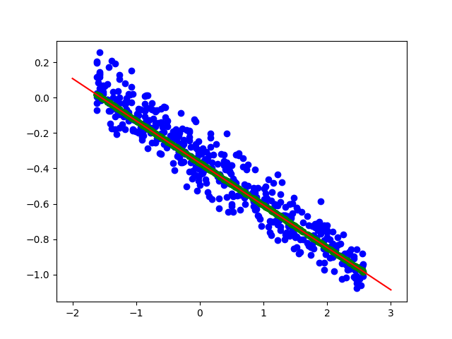
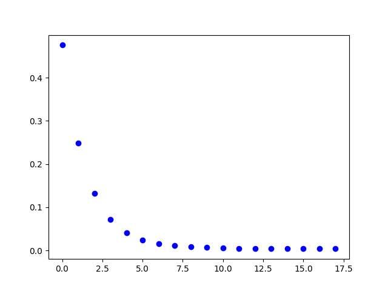

# Linear Regression with Gradient Descent

This project implements Linear Regression using the Gradient Descent algorithm. Linear Regression is a linear model that assumes a linear relationship between the input variables (x) and the single output variable (y). It calculates y from a linear combination of the input variables.

## Project Overview

- Train the linear regression model on the given dataset and test its performance on the test data.
- Implement the linear regression model using the Closed Form solution and the Gradient Descent algorithm (batch or stochastic).
- Normalize the data to improve model performance.
- Plot the datasets and regression lines.
- Plot the cost function for enough iterations during Gradient Descent.
- Report the learned parameters (θ0, θ1, ..., θn), and the Mean Squared Error (MSE) on both the train and test data.
- Report the decision boundary in the format of "y = ax + b".

### Linear Regression with Gradient Descent

In Linear Regression, we aim to predict a continuous target variable $\( y \)$ based on one or more input features $\( x_1, x_2, ..., x_n \)$. The predicted value $\( \hat{y} \)$ is given by the equation:

$\[ \hat{y} = \theta_0 + \theta_1x_1 + \theta_2x_2 + ... + \theta_nx_n \]$

Where:
- $\( \hat{y} \)$ is the predicted target variable,
- $\( x_1, x_2, ..., x_n \)$ are the input features,
- $\( \theta_0, \theta_1, ..., \theta_n \)$ are the coefficients (parameters) to be learned.

#### Cost Function

The cost function measures the difference between the predicted values and the actual values in the training data. One commonly used cost function for Linear Regression is the Mean Squared Error (MSE), defined as:

$\[ J(\theta) = \frac{1}{2m} \sum_{i=1}^{m} (\hat{y}_i - y_i)^2 \]$

Where:
- $\( J(\theta) \)$ is the cost function,
- $\( m \)$ is the number of training examples,
- $\( \hat{y}_i \)$ is the predicted value for the $\( i^{th} \)$ example,
- $\( y_i \)$ is the actual value for the $\( i^{th} \)$ example.

#### Gradient Descent

Gradient Descent is an optimization algorithm used to minimize the cost function. The update rule for each parameter $\( \theta_j \)$ in Batch Gradient Descent is given by:

$\[ \theta_j = \theta_j - \alpha \frac{\partial}{\partial \theta_j} J(\theta) \]$

Where:
- $\( \alpha \)$ is the learning rate.

The partial derivative $\( \frac{\partial}{\partial \theta_j} J(\theta) \)$ represents the gradient of the cost function with respect to $\( \theta_j \)$.

#### Gradient Calculation

To compute the gradient of the cost function, we calculate the derivative of $\( J(\theta) \)$ with respect to each parameter $\( \theta_j \)$. For the MSE cost function, the gradient for $\( \theta_j \)$ is given by:

$\[ \frac{\partial}{\partial \theta_j} J(\theta) = \frac{1}{m} \sum_{i=1}^{m} (\hat{y}_i - y_i) x_{ij} \]$

Where:
- $\( x_{ij} \)$ is the $\( j^{th} \)$ feature of the $\( i^{th} \)$ example.

#### Update Rule

The update rule for each parameter $\( \theta_j \)$ in Batch Gradient Descent becomes:

$\[ \theta_j = \theta_j - \alpha \frac{1}{m} \sum_{i=1}^{m} (\hat{y}_i - y_i) x_{ij} \]$

This update is applied simultaneously for all parameters $\( \theta_0, \theta_1, ..., \theta_n \)$ until convergence.

Gradient Descent iteratively updates the parameters of the Linear Regression model to minimize the cost function, leading to better predictions. By adjusting the learning rate and the number of iterations, Gradient Descent finds the optimal values of $\( \theta_0, \theta_1, ..., \theta_n \)$ that best fit the training data.

## Dataset

The dataset used in this project is provided in the `data.csv` file. The first 70% of the data is used for training, and the remaining 30% is used for testing.

## Implementation Details

- Read the `data.csv` file.
- Split the data into training and testing sets using libraries for data splitting.
- Normalize the data.
- Implement Linear Regression using Gradient Descent.
- Train the model using the training data.
- Test the model on the testing data.
- Plot the datasets and regression lines.
- Plot the cost function for a sufficient number of iterations during Gradient Descent.

## Results

- Learned Parameters:
  - $\( \theta_0 = -0.36933451\)$
  - $(\theta_1 = -0.2392315\)$

- Decision boundary:

- Mean Squared Error (MSE):
  

## How to Run

1. Clone this repository.
2. Navigate to the project directory.
3. Ensure you have all dependencies installed.

